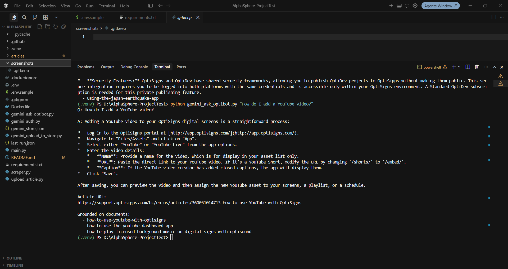

# OptiBot Mini-Clone

A small RAG pipeline that clones OptiSigns' support bot, **OptiBot**:

1. **Scrape** every article from [support.optisigns.com](https://support.optisigns.com) → clean Markdown.
2. **Index** those docs into a **Gemini File Search store** (via API) and answer questions with citations.
3. **Daily job** re-scrapes and uploads only the delta (new/updated), with logs.

## Setup

```bash
python -m venv .venv
.venv\Scripts\Activate.ps1        # Windows  (macOS/Linux: source .venv/bin/activate)
pip install -r requirements.txt
copy .env.sample .env             # then set GEMINI_API_KEY  (free: https://aistudio.google.com/apikey)
```

## Run locally

```bash
# 1. Scrape support site -> articles/<slug>.md  (404 articles; --max 30 for a quick run)
python scraper.py

# 2. Upload docs to the Gemini File Search store (API only, no UI)
python gemini_upload_to_store.py           # --max 40 for a quick test batch

# 3. Ask OptiBot (sanity check)
python gemini_ask_optibot.py               # "How do I add a YouTube video?"

# Daily delta job (scrape + upload only changed docs)
python main.py                             # $env:MAX_ARTICLES="40" to limit
```

## How it works

- **Scrape:** the support site is a **Zendesk Help Center** with a public JSON API
  (`/api/v2/help_center/en-us/articles.json`). The API returns the article body only —
  no nav/ads — which we clean with BeautifulSoup and convert to Markdown (`markdownify`),
  preserving headings, links, lists, images and code blocks. Each file gets YAML
  frontmatter plus an `Article URL:` line so OptiBot can cite it.
- **Index / assistant:** Gemini **File Search** chunks + embeds each doc. The verbatim
  system prompt and the File Search tool are passed on every request.
- **Delta job:** `main.py` hashes each article (SHA-256) and stores the hash in the
  document's `custom_metadata`. On each run it compares hashes to upload only
  **new + updated** docs — stateless, so it works in ephemeral containers. Counts
  (`added / updated / skipped`) are printed and written to `last_run.json`.

### Chunking strategy

Gemini **white-space** chunking, `max_tokens_per_chunk=512` (Gemini's hard limit),
`max_overlap_tokens=100` (~20% overlap so step lists aren't cut mid-instruction).
Support articles are short/structured, so this indexes each in a few chunks
(404 docs ≈ 570K tokens ≈ ~1,500 chunks). Gemini doesn't report an exact chunk
count, so the scripts estimate it with `tiktoken` using the same parameters.

### System prompt (verbatim)

```
You are OptiBot, the customer-support bot for OptiSigns.com.
• Tone: helpful, factual, concise.
• Only answer using the uploaded docs.
• Max 5 bullet points; else link to the doc.
• Cite up to 3 "Article URL:" lines per reply.
```

## Docker

```bash
docker build -t optibot-sync .
docker run --rm -e GEMINI_API_KEY=your-key optibot-sync   # runs once, exits 0
```

## Daily job & logs

Scheduled via **GitHub Actions** (`.github/workflows/daily-sync.yml`) at 06:00 UTC
daily + manual dispatch. Set repo secret `GEMINI_API_KEY` (**Settings → Secrets and
variables → Actions**). `last_run.json` is uploaded as an artifact each run.

- **Job logs:** https://github.com/PHUPhan1707/Project-for-Testing/actions/runs/28729235860

## Screenshot
Screenshot of assistant answering a sample question:



## Demo video

End-to-end walkthrough (scrape → upload → ask OptiBot → daily delta job):

[▶ Watch demo video](screenshots/VideoDemoProject.mp4)

## Files

| File | Purpose |
|------|---------|
| `scraper.py` | Scrape support site → Markdown |
| `gemini_auth.py` | Resolve Gemini API key (.env / env / prompt) |
| `gemini_upload_to_store.py` | Bulk-upload docs to Gemini File Search (API) |
| `upload_article.py` | Upload a single article by slug |
| `gemini_ask_optibot.py` | Query OptiBot (sanity check) |
| `main.py` | Daily scrape + delta-upload job |
| `Dockerfile` / `.github/workflows/daily-sync.yml` | Container + daily schedule |


